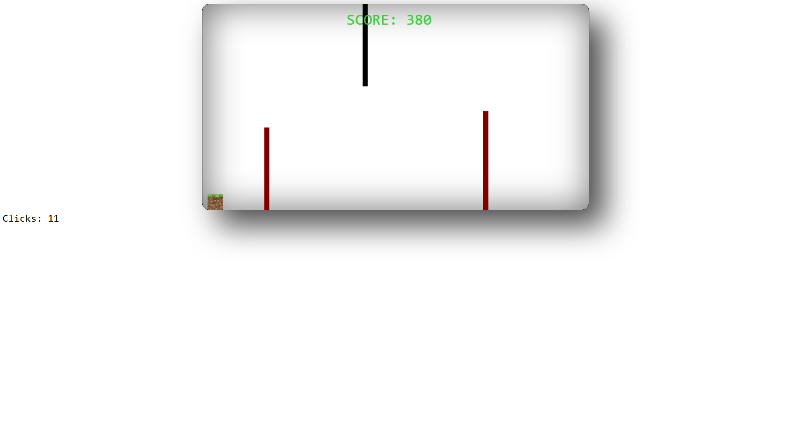
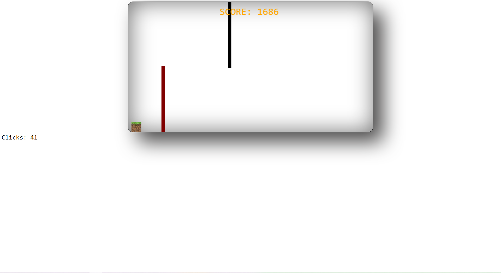
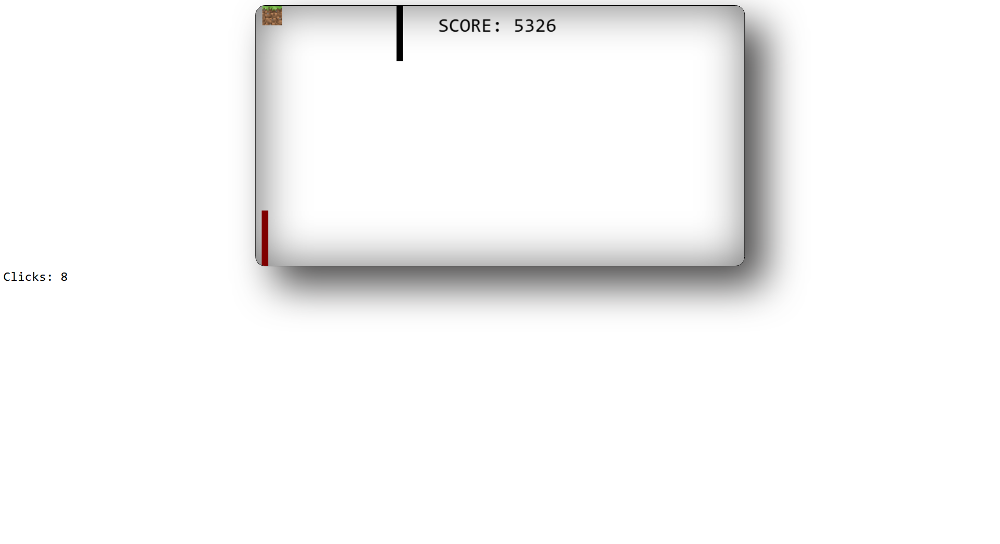
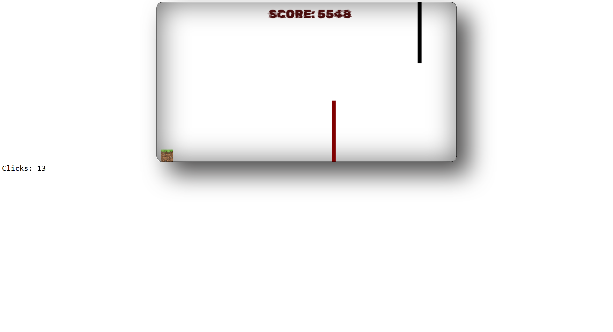
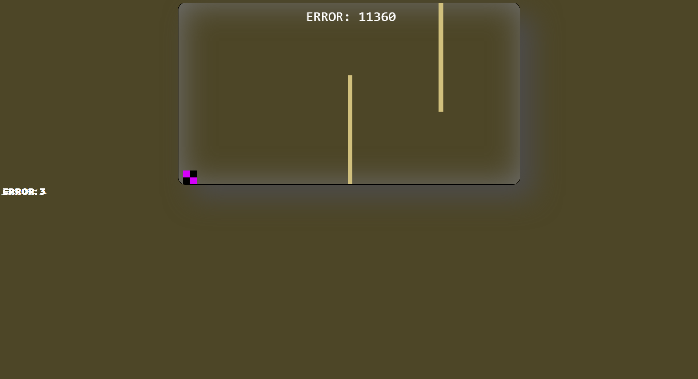
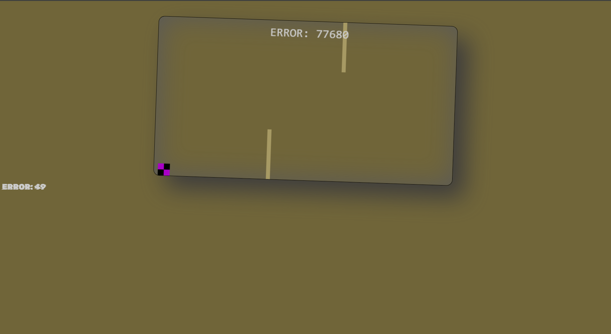
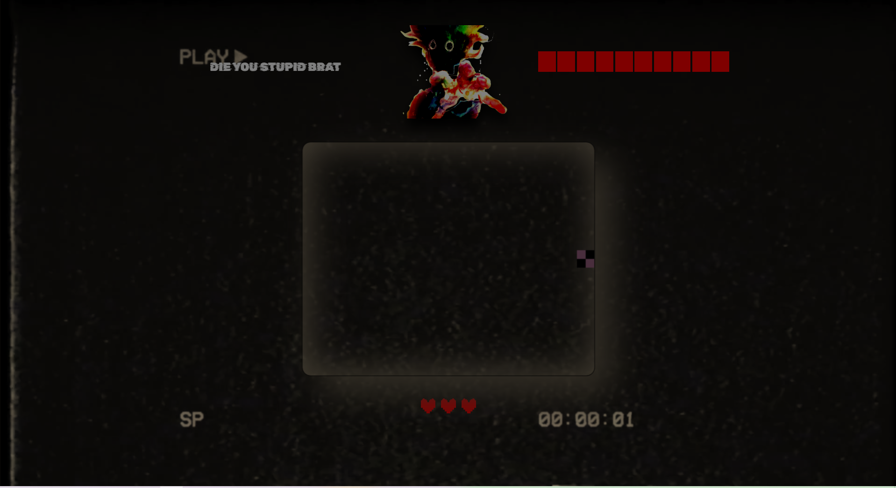
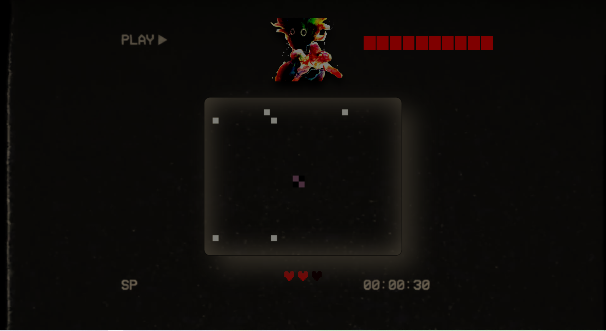
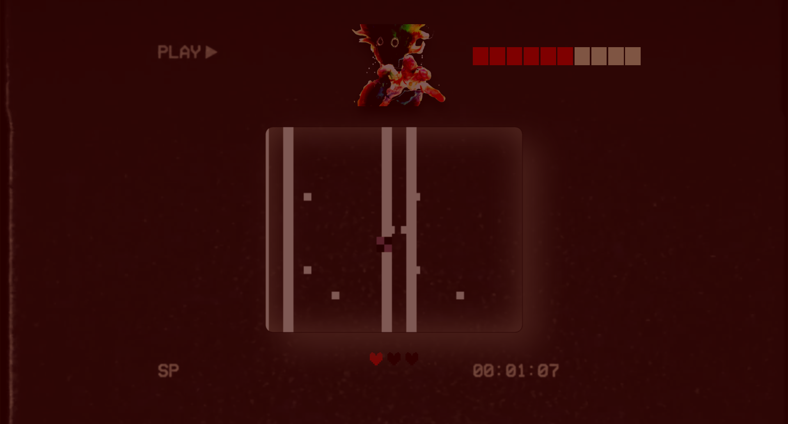
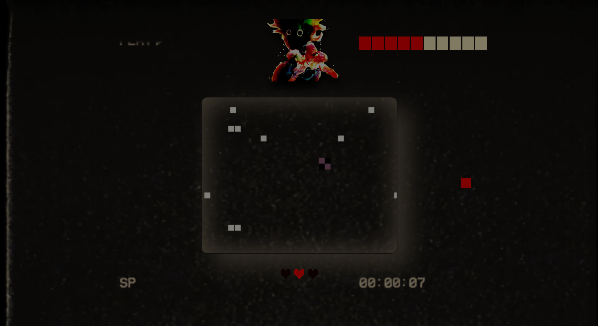

# 🎮 its.all.a.lie

> *"A surreal browser game where things slowly stop making sense."*

Built with **HTML**, **CSS**, and **JavaScript** where reality slowly begins to fall apart.

---

> 🎧 **Best experienced with headphones.**
>
> Music and sound effects are an essential part of the atmosphere and gameplay.

---

## 📖 About

At first glance, **its.all.a.lie** appears to be a simple arcade game.

You control a small block and your goal is straightforward:

> **Avoid obstacles. Stay alive. Beat your high score.**

The longer you survive, the faster the game becomes.

Or at least...

that's what it wants you to believe.

---

## ✨ Features

- 🎮 Simple one-button gameplay
- ⚡ Progressive difficulty
- 📈 Endless score system
- 🎵 Dynamic soundtrack
- 🎨 Custom visuals and effects
- 👾 Hidden gameplay mechanics
- 💀 No checkpoints during the first run — one mistake means starting over
- ❓ More than meets the eye...

---

## 🎮 Controls

| Action | Key |
|--------|-----|
| Switch lanes | **Space** |

---

## 🛠️ Technologies

- HTML5
- CSS3
- JavaScript
- HTML Canvas
- Audio & Video integration

---

## 📂 Project Structure

```text
its.all.a.lie/
├── index.html
├── style.css
├── script.js
├── images/
├── music/
└── bg/
```

---

# 📸 Screenshots

## 🌿 Beginning

<p align="center">
    
</p>

The game starts as a simple arcade challenge.

Avoid obstacles, survive as long as possible and increase your score while the game gradually becomes faster.

---

## 🔥 Difficulty Progression

<p align="center">
    
</p>

The difficulty increases through multiple stages.

As your score grows, the game becomes faster and more demanding.

---

## ⚫ Final Stage

<p align="center">
    
</p>

By the time you reach the final difficulty tier...

you may start noticing that something doesn't feel quite right.

---

# ⚠️ Everything below this point is a lie.

Or maybe not.

The following section contains **major gameplay spoilers**, hidden mechanics and the ending.

If you want to experience the game as intended...

**Play it first.**

<details>

<summary><b>👁️ Click to reveal spoilers</b></summary>

<br>

# 🌌 Reality Starts Breaking

## 📺 First Glitches

<p align="center">
    
</p>

After reaching around **5,500 points**, the first visual glitches begin to appear.

The score occasionally changes its font and color.

Even the browser icon starts behaving strangely.

Everything quickly returns to normal...

...or does it?

---

## 🟨 The Yellow World

<p align="center">
    
</p>

Around **10,000 points**, the game changes dramatically.

The calm atmosphere disappears.

You will notice:

- 🟨 A completely different background.
- 🎵 A new soundtrack.
- 👾 Your character transforms.
- ⚠️ Every interface element becomes **ERROR**.
- 📺 A corrupted browser title.
- 🖱️ Glitching mouse cursor.
- 🎨 Distorted colors and visuals.

At this point the game stops pretending to be a normal arcade game.

---

## 📉 The Collapse

<p align="center">
    
</p>

As your score keeps increasing, reality begins collapsing.

The game window slowly sinks downward while the music fades away.

The transition is gradual, making the final reveal feel natural rather than sudden.

---

# 👾 Final Boss

<p align="center">
    
</p>

At **100,000 points**, the arcade game finally reveals its true purpose.

The final boss introduces completely new gameplay mechanics inspired by classic bullet-hell games.

---

## 🎮 Boss Controls

| Action | Control |
|--------|---------|
| Move | **W A S D** |
| Attack | **Left Mouse Button** |

---

## ⚔️ Boss Mechanics

<p align="center">
    
</p>

The boss battle features:

- ❤️ Health system
- 🟣 Bullet-hell attacks
- 🦴 Bone spike attacks
- 🎯 Clickable weak points
- 🔊 Custom sound effects
- ⚡ Multiple combat phases

The longer the fight lasts...

the harder it becomes.

---

## 💀 YOU DIED

<p align="center">
    
</p>

After dealing enough damage, something unexpected happens.

The boss crushes the player.

The famous **YOU DIED** screen appears...

and it seems like everything is over.

Except...

it isn't.

---

# 🔄 One Last Lie

<p align="center">
    
</p>

The game appears to restart.

But something feels different.

Everything is covered in sepia.

The music changes once again.

This time:

- ❤️ You only have **one heart**.
- 👾 The boss returns with reduced health.
- ⚔️ New attack patterns appear.
- 🦴 Bone attacks return during the final phase.

This is the true ending.

---

# 🏆 Ending

Defeat the boss one final time...

and discover why the game is called **its.all.a.lie**

</details>

---

## 💡 Trivia

- 🕒 The entire game was created in approximately **10 days**.
- 🎧 The experience was designed with headphones in mind.
- 👾 Most visual glitches are intentional gameplay mechanics.
- 🎵 Music evolves together with the game's atmosphere.
- 🎭 The project intentionally deceives the player by slowly changing its own rules.

---

## 📜 Status

This is one of my earlier web development projects.

I'm currently improving the project's code structure and overall quality while preserving the original gameplay and ideas that inspired it.
